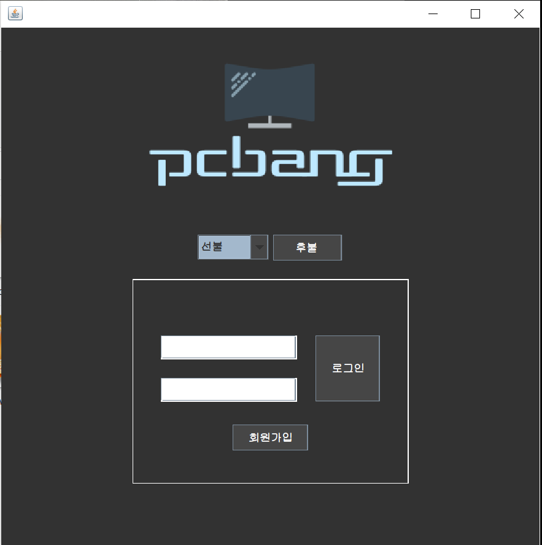
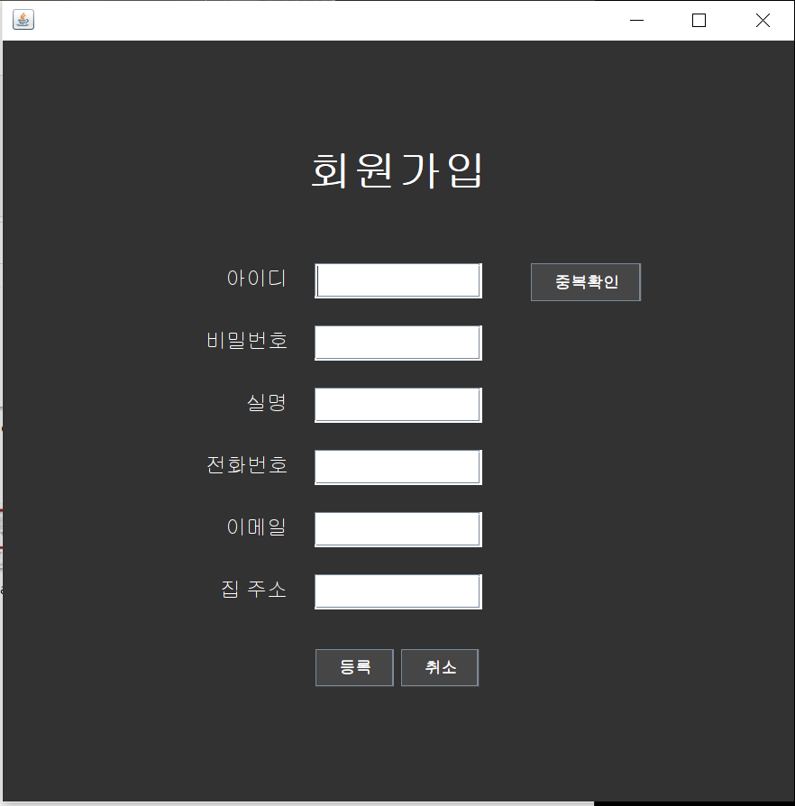
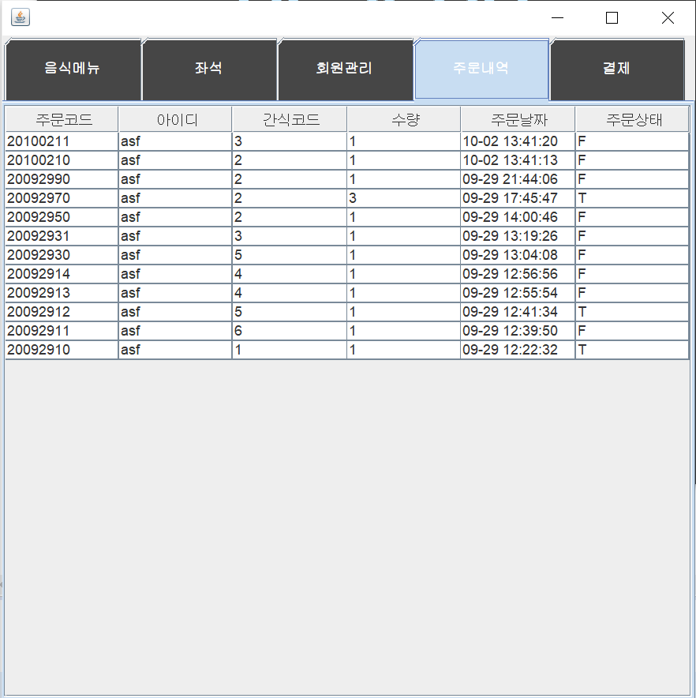
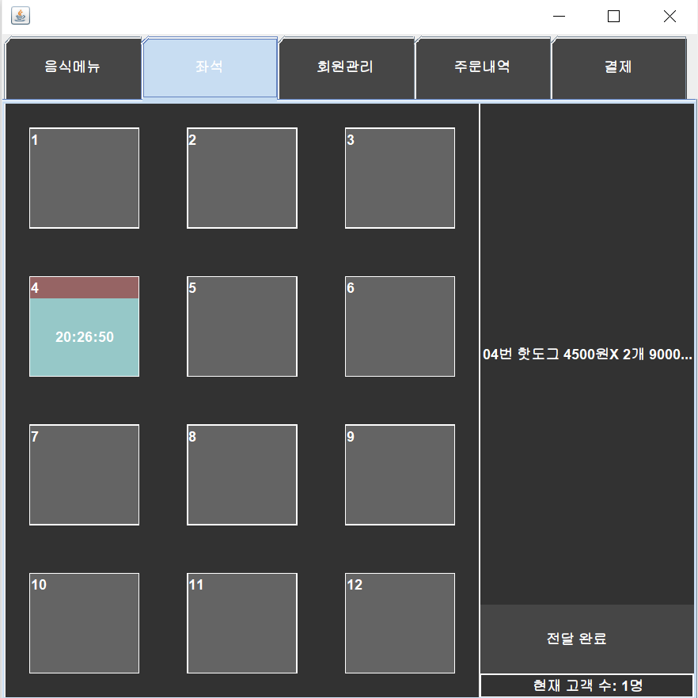
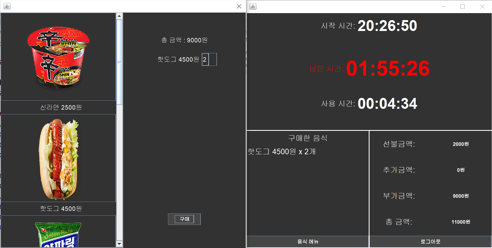

# PC방

### 개요

- PC방 구현 프로그램
- PC방 고객들의 회원정보, 이용 좌석, 및 이용시간과 간식구매에 관한 정보를 알아볼 수 있는 프로그램

### 시스템 개발의 필요성

- 오늘 고용된 알바생도 쉽고 편리하게 사용할 수 있는 PC방 프로그램을 구성
- 데이터베이스와 쓰레드와 네트워크를 활용할 수 있는 주제로 선정하여 구현
- PC방 회원이 로그인을 하면 좌석을 배부해주는 동시에 관리자가 확인가능
- 손님이 간식을 주문하면 관리자가 확인 후 전달 가능
- 사용하기 쉬운 화면 디자인

